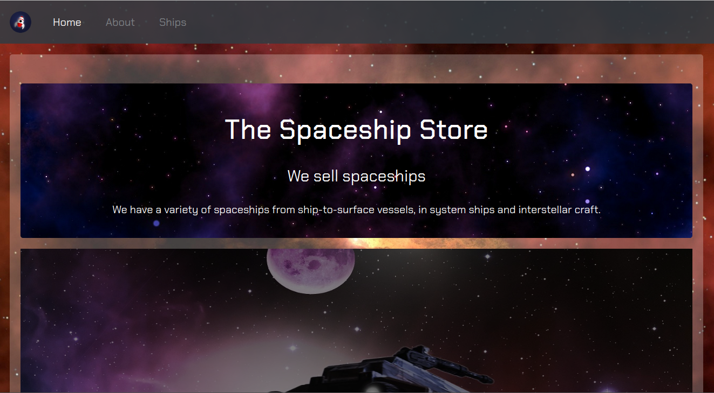
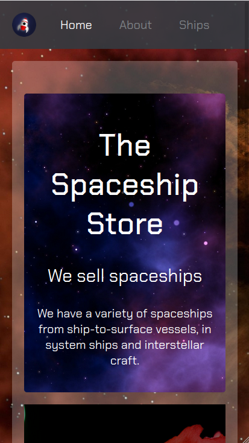

# The Spaceship Store

> A website for the fictional Spaceship Store.

## Table of contents

- [General info](#general-info)
- [Screenshots](#screenshots)
- [Technologies](#technologies)
- [Learnings](#learnings)
- [Setup](#setup)
- [Status](#status)
- [Contact](#contact)

## General info

I needed to try making my own site in Drupal. To make things easier, I used a landing page I'd made in Bootstrap, so I already had all the content.

## Screenshots

## Technologies

- Drupal
- CSS

## Learnings

- Tge basics of Drupal and theming in Drupal

## Setup

This can only be viewed on my computer, since that's the only place the database is stored.

## Status

Project is: _finished_

## Contact

Created by [nicm42](https://twitter.com/nicm4242/) - feel free to contact me!
